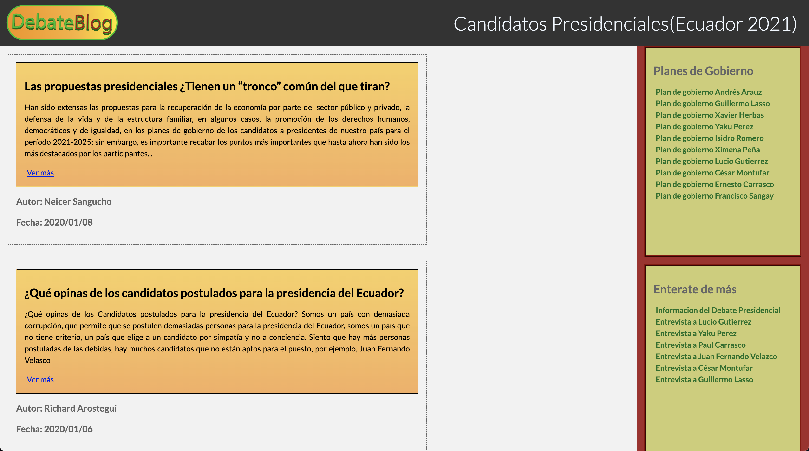

# Debate-blog - [OLD PROJECTS]
In 2021 as a Literature assignment I built a static web page in blog format for sharing thoughts about votes.

## About

In 2021 I built a static web page in blog format for sharing thoughts about votes. Debate blog is a simple project that I made for a Literature assignment. The main goal was to access the knowledge of candidates for the position of class president.
You can access for videos and government proposals.
I used to don't share my code at all, now I wanna create a collection with old projects and share them with the community as a way to show my progress and how I've evolved as a developer.

## Deployment

[Click here to access the project](https://cotbert2.github.io/Debate-blog/)